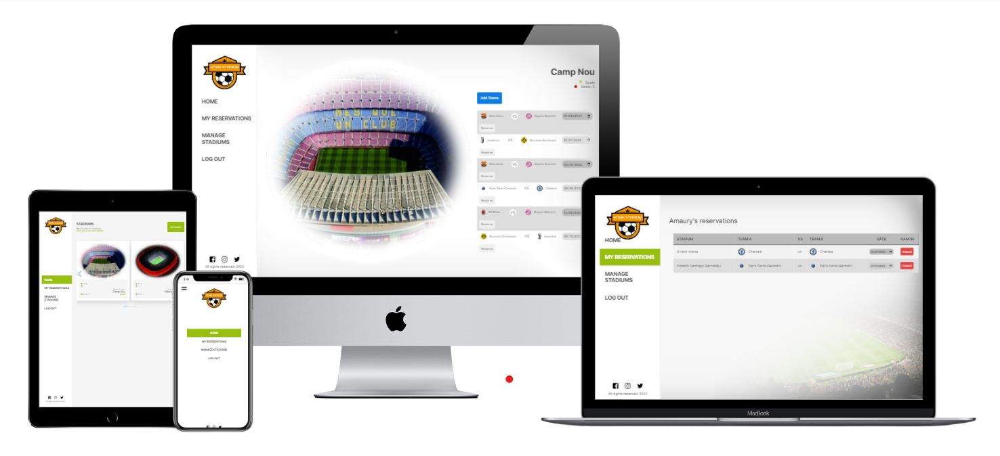

# Final capstone project - Home Stadium

> We developed the front-end section of the final capstone project where we create interfaces in which you can reserve football games in your favorites stadiums.

> ### Home Stadium home-page.
> It shows a slider with the currently available stadiums and a button where you can add a new one.
> ### Stadium page.
> Here you can reserve the game that you would like to assist and also you can add new games to the current stadium.
> ### My Reservations
> In this section you can se your current selected games reservations.
> ### Manage Stadiums
> Here you can delete any stadium on the list.

## Built With

- JavaScript
- React & Redux

## Live Demo (https://homestadium.netlify.app/home)

[Live Demo](https://homestadium.netlify.app/home)

# Getting Started with Create React App

This project was bootstrapped with [Create React App](https://github.com/facebook/create-react-app).

## Available Scripts

In the project directory, you can clone the repository with the following link:
`https://github.com/rega1237/front-end-capstone-fullstack.git`

 Once you have clone the repository run:
 `npm install`
 to install all the dependencies that you need.
 Then you can run a live version with the command `npm start`.

## Author

👤 **Amaury Perez**

- GitHub: [@Trictonicmp](https://github.com/Trictonicmp)
- LinkedIn: [Amaury Permer](https://linkedin.com/in/amaury-permer)

👤 **Arturo Hermida**

- GitHub: [@Artbsc1992](https://github.com/Artbsc1992)
- Twitter: [@Arturo_D_Rock](https://twitter.com/Arturo_D_Rock)
- LinkedIn: [Arturo Hermida](https://www.linkedin.com/in/arturo-hermida29/)

## 🤝 Contributing

Contributions, issues, and feature requests are welcome!

Feel free to check the [issues page](../../issues/).

## Show your support

Give a ⭐️ if you like this project!

## Acknowledgments

- Hat tip to anyone whose code was used
- Inspiration
- etc

## 📝 License

This project is [MIT](./LICENCE) licensed.
